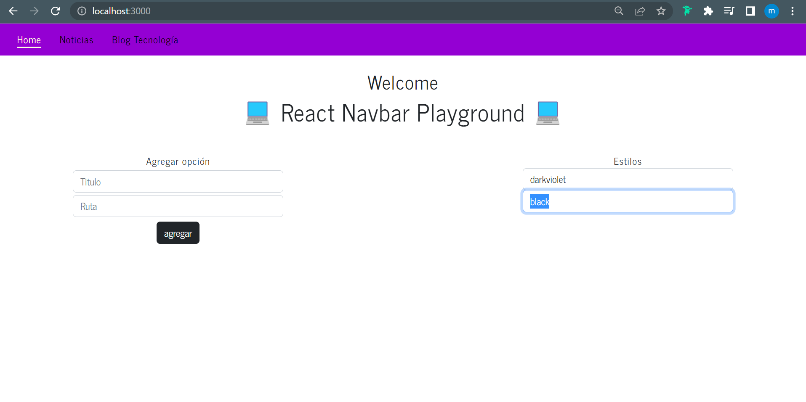
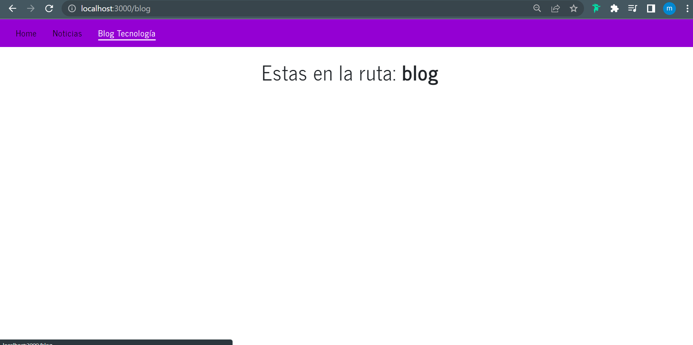

### INSTALAR DEPENDENCIAS

```bash
npm i --legacy-peer-deps
```

### RESOLVER CONFLICTOS DE DEPENDENCIAS

```bash
npm audit fix --force
```

### LEVANTAR EL SERVIDOR DE DESARROLLO

```bash
npm start
```

### SCREENSHOT



